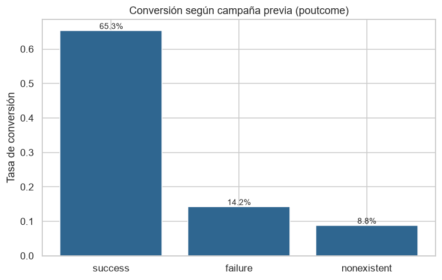
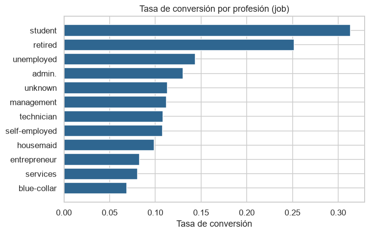
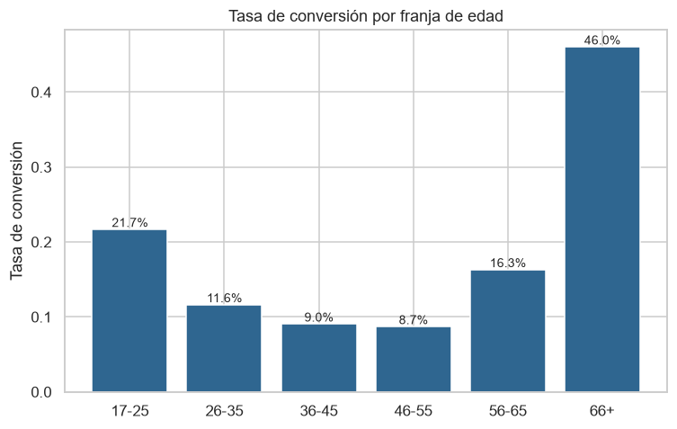
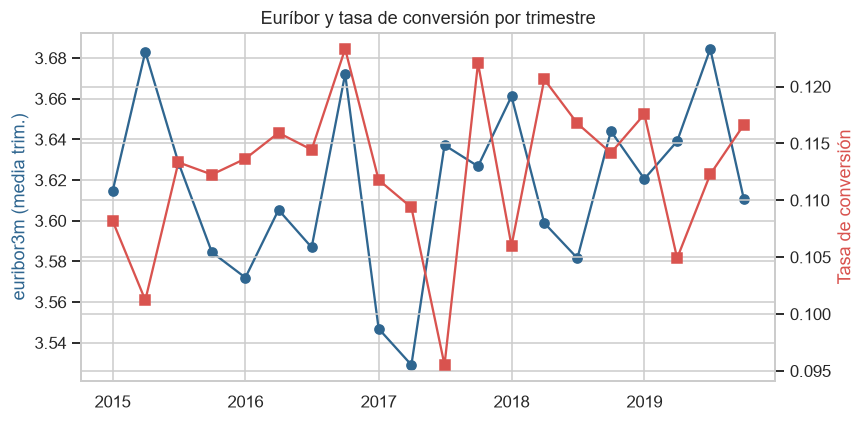
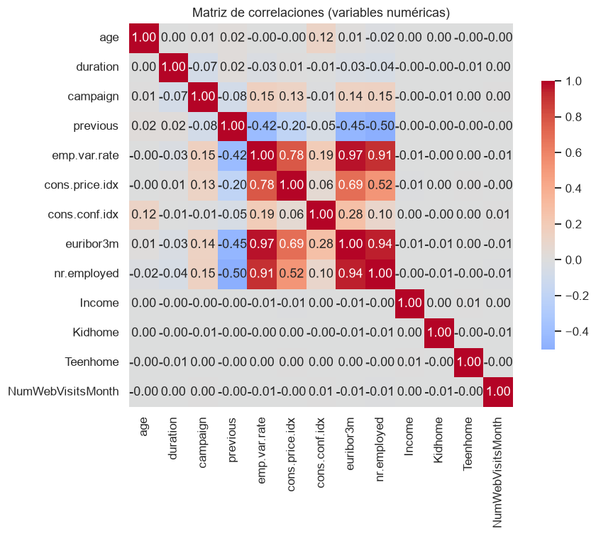

# Proyecto EDA — Campañas de marketing bancario

Análisis Exploratorio de Datos (EDA) en **Python + Pandas** sobre las campañas de
marketing telefónico de una institución bancaria portuguesa. El objetivo comercial de
esas campañas era que el cliente suscribiese un **depósito a plazo** (variable objetivo
`y`), y el objetivo de este proyecto es responder a una pregunta:

> **¿Qué caracteriza a los clientes que sí suscriben el depósito?**

Es decir, qué variables —perfil del cliente, canal de contacto, historial de campañas y
contexto macroeconómico— se asocian con una mayor **tasa de conversión**.

---

## Conjuntos de datos

| Fuente | Descripción |
|---|---|
| `bank-additional.csv` | 43.000 registros, uno por interacción de campaña (edad, profesión, canal, resultado, indicadores macro, etc.). |
| `customer-details.xlsx` | Excel de 3 hojas (`2012`, `2013`, `2014`), 43.170 fichas de cliente (ingresos, hijos, visitas web, fecha de alta). Se cruza con el CSV por el identificador de cliente. |

Ambas fuentes se cruzan por el identificador único (`id_` en el CSV ↔ `ID` en el Excel).

---

## Estructura del repositorio

```
.
├── README.md                          → este documento (pasos + informe)
├── eda_bank_marketing.py              → análisis completo como script ejecutable de una vez
├── DATOS/
│   ├── DATOS_INICIALES/               → datos en bruto, sin modificar
│   │   ├── bank-additional.csv
│   │   └── customer-details.xlsx
│   ├── DATOS_PROCESADOS/              → datos tras la limpieza y la unión
│   │   ├── datos_procesados.csv       → dataset completo limpio y unido (43.170 filas)
│   │   └── datos_con_campanha.csv     → subconjunto con campaña (43.000 filas), listo para análisis
│   └── IMAGENES/                      → figuras generadas por el análisis
├── NOTEBOOKS/
│   └── eda_bank_marketing.ipynb       → cuaderno paso a paso, con salidas y figuras
└── INFO/                              → enunciado y criterios de evaluación del proyecto
```

El **notebook** y el **script** son equivalentes: mismos pasos y misma lógica. El
notebook (`NOTEBOOKS/eda_bank_marketing.ipynb`) sirve para revisar cada paso con su
salida; el script (`eda_bank_marketing.py`), para ejecutar el proceso completo de golpe.

---

## Requisitos y ejecución

Requiere Python 3.10+ y las siguientes librerías:

```bash
pip install pandas numpy matplotlib seaborn openpyxl
```

**Ejecutar el script completo** (genera los datos procesados y las figuras). Desde la
raíz del proyecto:

```bash
python eda_bank_marketing.py
```

Al ejecutarlo se crean los dos CSV en `DATOS/DATOS_PROCESADOS/` y las 10 figuras en
`DATOS/IMAGENES/`.

**Revisar el notebook** paso a paso: abrir `NOTEBOOKS/eda_bank_marketing.ipynb` en
Jupyter o Visual Studio Code y ejecutarlo de arriba abajo. Tanto el notebook como el
script resuelven las rutas automáticamente, así que funcionan sin ajustes manuales
independientemente de desde dónde se lancen.

---

## Pasos del proyecto

### 1. Limpieza y transformación (`bank-additional`)

| Problema detectado | Tratamiento aplicado | Motivo |
|---|---|---|
| Columna índice `Unnamed: 0` | Eliminada | Es un índice sobrante sin valor. |
| Decimales con coma como texto (`cons.price.idx`, `cons.conf.idx`, `euribor3m`, `nr.employed`) | Coma → punto y conversión a `float` | Sin ello no se pueden calcular medias, correlaciones ni graficar. |
| Categóricas en mayúsculas (`marital`, `poutcome`) | Normalizadas a minúscula | Evitar categorías duplicadas por formato. |
| Fecha en español (`"2-agosto-2019"`) | Parseada a `datetime` con un diccionario de meses y una función propia | Habilita el análisis temporal; deja `NaT` los 248 valores irrecuperables. |
| `default`, `housing`, `loan` (binarias con muchos nulos) | Convertidas a categórica `no` / `yes` / `unknown` | Imputar por moda falsearía el reparto (`default` tiene ~21% de nulos). El nulo se conserva como categoría informativa. |
| `job`, `education`, `marital` (nulos) | Rellenados con `"unknown"` | Preserva la señal de "dato ausente" sin inventar valores. |
| `age` (~12% nulos) | Imputada con la **mediana por profesión** | Más correcta que la mediana global; se comparó y apenas distorsiona. |
| `euribor3m`, `cons.price.idx` (nulos) | Mediana **agrupada por `emp.var.rate`** | Respeta el "régimen económico" del momento en lugar de una mediana global ciega. |
| `pdays == 999` (código, no un valor) | Nueva columna `contactado_antes` (`si`/`no`) | Evita contaminar los cálculos numéricos y permite analizar el grupo. |
| `latitude`, `longitude` (no documentadas) | **Descartadas** | Se comprobó que son coordenadas sintéticas aleatorias (uniformes sobre EEUU, correlación ≈0, sin relación con nada): no aportan señal. |

### 2. Limpieza (`customer-details`)

El Excel estaba limpio (sin nulos, `ID` único). Se eliminó el índice sobrante y se
derivó el año de alta desde `Dt_Customer`, verificando que coincide con la hoja de
origen (control de calidad).

### 3. Unión de los datasets

Se cruzan con un `merge` **outer con `indicator=True`**, que etiqueta cada fila como
`both`, `right_only` o `left_only`. Resultado:

- **43.000** registros `both` → clientes con campaña (base del análisis).
- **170** registros `right_only` → clientes **sin campaña**, identificados
  explícitamente en vez de perderse en un *join* interno.
- **0** `left_only` → todas las campañas tienen su cliente.

El resultado se guarda en `DATOS/DATOS_PROCESADOS/` como `datos_procesados.csv` (dataset
completo) y `datos_con_campanha.csv` (subconjunto con campaña, base del análisis).

---

## Informe del análisis

La **tasa de conversión global es del 11,3%** (4.844 de 43.000): un problema
desbalanceado que sirve de referencia contra la que comparar cada grupo.

### El historial de campañas es el factor más determinante



Un cliente cuya campaña anterior fue un éxito (`poutcome == success`) suscribe el
**65,3%** de las veces, frente al 8,8% de quien nunca fue contactado. En la misma línea,
haber sido contactado antes eleva la conversión al **64,0%**. La fidelización pesa más
que cualquier variable de perfil.

### El canal importa: el móvil convierte casi el triple

El contacto por móvil (`cellular`) convierte al **14,7%**, frente al **5,2%** del
teléfono fijo (`telephone`).

### Perfil del cliente: profesión y edad



`student` (31,3%) y `retired` (25,2%) son los mejores objetivos; `blue-collar` (6,9%) y
`services` (8,1%), los más difíciles. La conversión por edad dibuja una **U**: alta en
los extremos y baja en la edad activa central.



Los mayores de 65 (46,0%) y los jóvenes de 17-25 (21,7%) convierten muy por encima de la
media, mientras que el tramo 36-55 se queda en torno al 9%. Es coherente con el
liderazgo de estudiantes y jubilados.

### Contexto macroeconómico



A nivel de registro, el euríbor correlaciona **negativamente** con la conversión
(**−0,31**): con tipos bajos, el depósito resulta más atractivo. No obstante, la media
trimestral del euríbor es plana en 2015-2019 pese a su enorme dispersión, lo que indica
que la dimensión temporal del dataset fue asignada de forma artificial y **no debe
sobre-interpretarse como una tendencia real**.



El bloque de indicadores macro (`emp.var.rate`, `euribor3m`, `nr.employed`,
`cons.price.idx`) está muy autocorrelacionado (0,7-0,97): son reflejos del mismo ciclo.
En cambio, las variables demográficas del Excel (`Income`, `Kidhome`, `Teenhome`,
`NumWebVisitsMonth`) tienen correlación ≈0 con todo, incluida la conversión.

### El "dato ausente" también informa

En `default`, el grupo `unknown` convierte menos de la mitad (5,2%) que el grupo `no`
(12,9%). Haber tratado los nulos como una categoría propia —y no imputarlos— resultó
clave para no perder esa señal.

### Clientes sin campaña

Los 170 clientes nunca contactados tienen un perfil demográfico similar al resto
(ingresos algo menores) y se concentran en altas de 2012. Son una bolsa de oportunidad
que la campaña no llegó a aprovechar.

---

## Conclusiones y recomendaciones

1. **Priorizar clientes con campañas previas exitosas** y **contactar por móvil**: son,
   con diferencia, las dos palancas de mayor impacto.
2. **Segmentar por estudiantes, jubilados y los extremos de edad**, donde la conversión
   es mucho mayor.
3. **Aprovechar las ventanas de euríbor bajo** para intensificar las campañas.
4. **Recuperar la bolsa de clientes nunca contactados** en futuras acciones.

### Limitaciones y decisiones razonadas

- **`duration` no es un predictor usable**: la duración de la llamada solo se conoce al
  terminarla, así que no sirve para decidir a quién llamar (usarla en un modelo causaría
  fuga de información). Se incluye solo como hallazgo descriptivo.
- **Coordenadas y eje temporal sintéticos**: `latitude`/`longitude` se descartaron y la
  dimensión temporal se interpreta con cautela.
- **Datos demográficos del Excel independientes de la conversión**: su correlación nula
  sugiere que se generaron sin relación con el resultado de campaña.
