# Consumo de los hogares en España en 2024

## Análisis del gasto familiar y su exposición a la inflación (EPF x IPC)

**Autor:** Néstor
**Fuentes:** Instituto Nacional de Estadística (INE)
**Datos:** Encuesta de Presupuestos Familiares 2024 e Índice de Precios de Consumo 2024

---

## 1. Introducción y objetivo

Este proyecto analiza cómo gastan los hogares españoles y, sobre todo, cómo les afecta la inflación de forma desigual según su nivel de renta. Para ello se combinan dos operaciones estadísticas oficiales del INE: la Encuesta de Presupuestos Familiares (EPF), que recoge el gasto real de los hogares por categoría de consumo, y el Índice de Precios de Consumo (IPC), que mide la evolución de los precios de esas mismas categorías.

El objetivo no es solo describir en qué gastan los hogares, sino responder a una pregunta con valor social y económico: ¿soportan todos los hogares la misma inflación? La hipótesis de partida es que no, y que los hogares de menor renta están más expuestos porque destinan una parte mayor de su presupuesto a las categorías cuyos precios más subieron (alimentación y vivienda). El cruce de ambas fuentes permite construir un indicador de "inflación sentida" que cuantifica ese efecto.

## 2. Datos y fuentes

Se han utilizado dos fuentes distintas del INE, relacionadas entre sí a través de la clasificación de consumo COICOP:

- **Fuente 1 — EPF 2024 (microdatos).** Ficheros de hogares y de gastos, unidos por el identificador de hogar. El fichero de gastos contiene 1.856.022 registros (una línea por hogar y partida de gasto) y el de hogares 19.410 registros con sus características socioeconómicas.
- **Fuente 2 — IPC 2024 (tabla de índices por comunidad autónoma y grupo ECOICOP).** Aporta el índice medio anual y la variación anual de precios de 2024 para cada categoría y territorio.

El conjunto de datos final, tras unir ambas fuentes al nivel de hogar por grupo de gasto, contiene 212.173 filas. Todos los importes monetarios de la EPF vienen elevados por el factor poblacional, por lo que el gasto por hogar en euros se obtiene dividiendo por dicho factor.

## 3. Metodología

El flujo de trabajo se ha realizado íntegramente con Python (pandas) en Visual Studio Code, y el panel interactivo con Power BI. Los pasos principales fueron:

1. **Transformación y limpieza.** Agregación del microdato de gastos al nivel de hogar por grupo de gasto (13 grupos COICOP 2018), selección de variables analíticas relevantes del fichero de hogares y traducción de las variables codificadas a etiquetas legibles a partir de los valores oficiales de la documentación de la EPF.
2. **Unión de las dos fuentes.** El gasto (EPF) se cruza con los precios (IPC) por comunidad autónoma y grupo de gasto.
3. **Validación.** La agregación propia reproduce exactamente el gasto total oficial del INE y el gasto medio por hogar coincide con la cifra publicada (34.044 euros anuales).
4. **Ponderación.** Todos los estadísticos se calculan ponderando por el factor de elevación de la muestra, de modo que los resultados representan al conjunto de hogares de España y no solo a la muestra encuestada.

## 4. Análisis descriptivo

**El gasto medio por hogar en 2024 fue de 34.044 euros anuales, con una mediana de 29.468 euros.** La diferencia entre media y mediana revela una distribución asimétrica hacia la derecha: existe una minoría de hogares con gasto muy elevado que eleva la media por encima del hogar típico. El 80 por ciento central de los hogares gasta entre 14.155 y 59.486 euros al año.

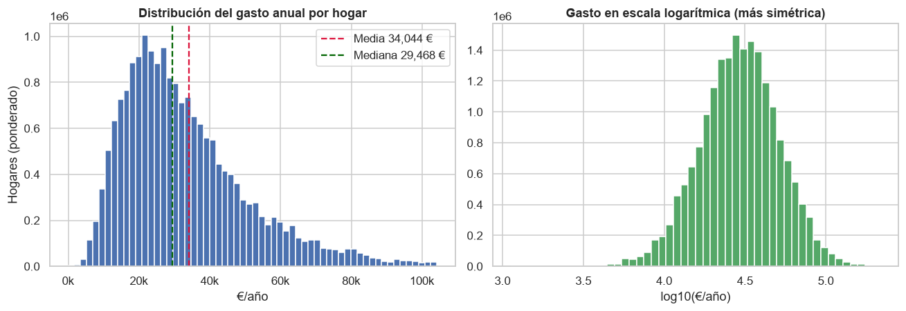

En cuanto a la composición del presupuesto, el gasto se concentra en unas pocas categorías. La vivienda (que incluye suministros de agua, electricidad y gas) es con diferencia la mayor partida, con un 32,4 por ciento del gasto total, seguida de la alimentación (15,8 por ciento), el transporte (11,4 por ciento) y la restauración y alojamiento (9,9 por ciento). Estas cuatro categorías suman casi el 70 por ciento del presupuesto de los hogares.

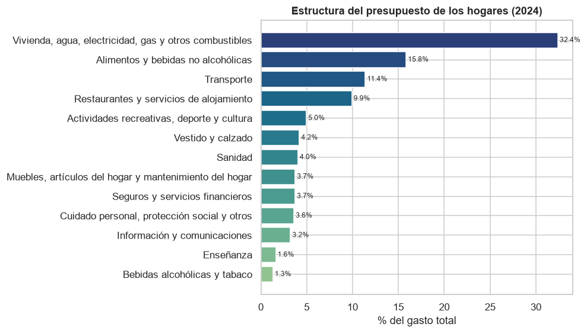

El perfil socioeconómico de los hogares muestra su distribución por nivel de ingresos, tamaño, régimen de tenencia y nivel de estudios del sustentador principal, y sirve de contexto para la segmentación posterior.

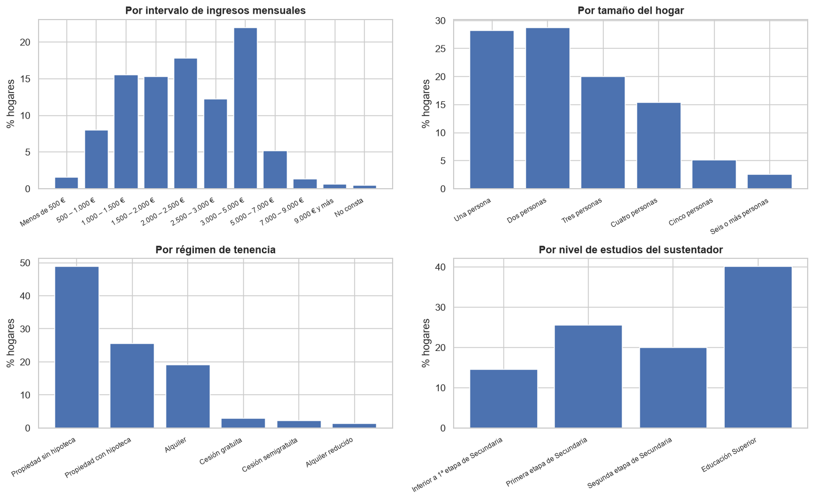

## 5. El gasto según el perfil del hogar

El análisis por segmentos confirma uno de los patrones más conocidos de la economía del consumo, la **Ley de Engel**: a medida que aumenta la renta del hogar, el peso de la alimentación en el presupuesto disminuye. En los hogares de menor renta la alimentación representa el 17,3 por ciento del gasto, mientras que en los de mayor renta baja hasta el 8,9 por ciento. La vivienda sigue el mismo patrón descendente pero de forma aún más marcada (del 48,2 al 30,8 por ciento), al tratarse de un gasto rígido que pesa muchísimo cuando la renta es baja. En sentido contrario, la restauración se comporta como un bien de lujo: su peso crece del 4,5 por ciento en los hogares de renta baja al 13,7 por ciento en los de renta alta.

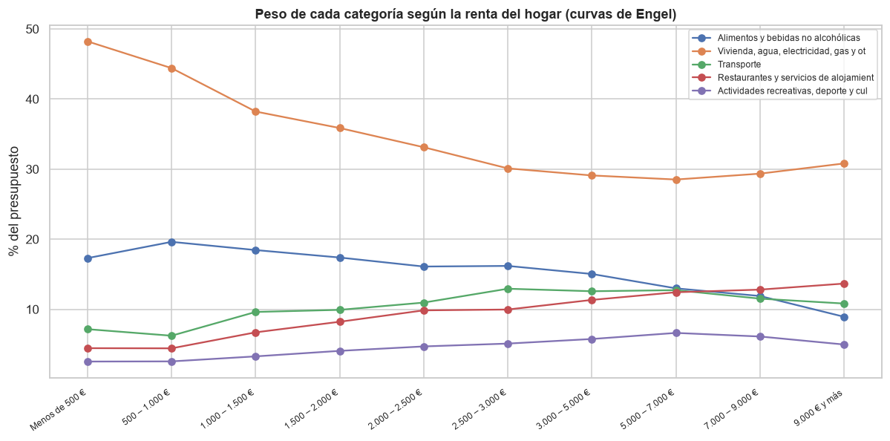

El gasto total también aumenta de forma clara con el tamaño del hogar y con el nivel de estudios del sustentador principal, dos factores estrechamente ligados a la capacidad económica.

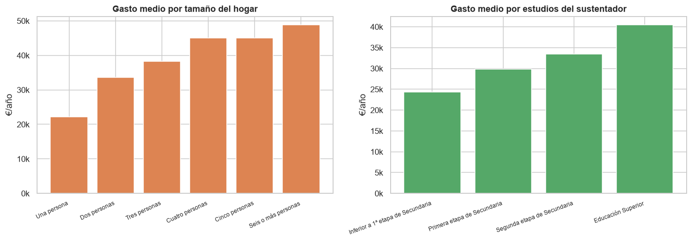

## 6. Dimensión territorial

Existen diferencias notables de gasto entre comunidades autónomas. **La Comunidad de Madrid encabeza el gasto medio por hogar, con 39.318 euros anuales, mientras que Extremadura lo cierra con 26.890 euros**, una diferencia superior al 45 por ciento entre ambos extremos.

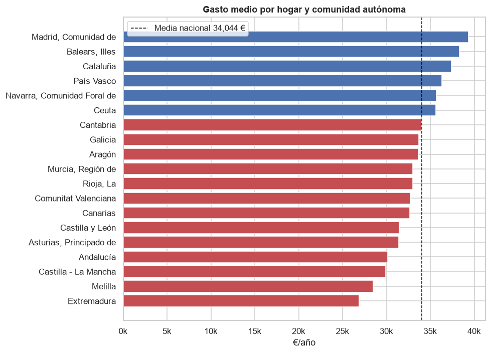

La composición del gasto también varía según el tamaño del municipio: en los núcleos más pequeños pesa más el transporte (por las mayores distancias), mientras que en las grandes ciudades gana peso la vivienda.

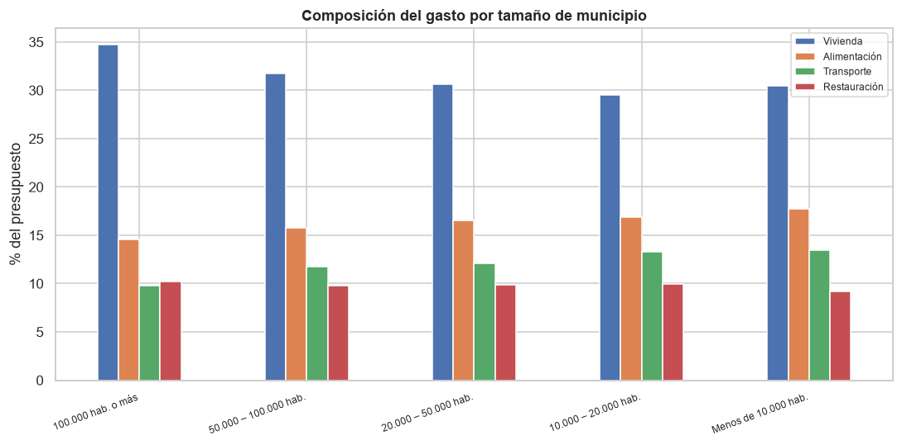

## 7. Consumo frente a inflación: el análisis diferencial

Esta es la aportación central del proyecto y lo que justifica haber unido las dos fuentes. Al cruzar el peso de cada categoría en el presupuesto con la inflación que sufrió esa categoría en 2024, se observa que las partidas de mayor peso (vivienda y alimentación) están entre las que registraron subidas de precios significativas.

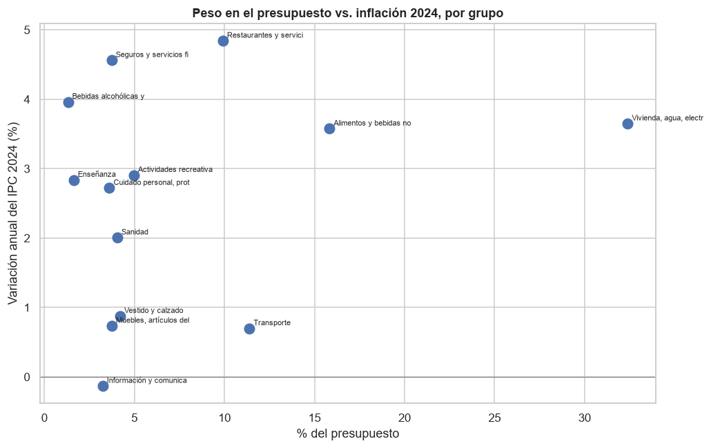

A partir de ahí se construye el indicador de **inflación sentida**: para cada hogar se calcula la subida media de precios ponderada por cuánto gasta realmente en cada categoría. El resultado confirma la hipótesis de partida. La inflación sentida media del conjunto de los hogares fue del 2,96 por ciento, pero **los hogares de menor renta soportaron una inflación del 3,26 por ciento, frente al 2,91 por ciento de los hogares de mayor renta.** Es decir, quien menos tiene sufre más la subida de precios, porque destina una proporción mayor de su presupuesto a lo esencial (alimentación y vivienda), que es precisamente donde más subieron los precios.

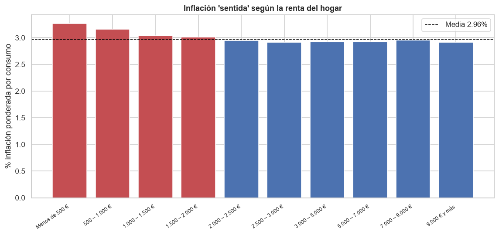

## 8. Análisis estadístico

Para confirmar que las diferencias observadas no son fruto del azar, se realizaron contrastes no paramétricos de Kruskal-Wallis sobre el gasto por hogar, adecuados dada la asimetría de su distribución. En los cuatro casos las diferencias son estadísticamente significativas (p menor que 0,001):

| Agrupación | Estadístico H | Significación |
|---|---|---|
| Por intervalo de ingresos | 8.396 | p < 0,001 |
| Por tamaño del hogar | 4.279 | p < 0,001 |
| Por nivel de estudios | 2.391 | p < 0,001 |
| Por comunidad autónoma | 609 | p < 0,001 |

El análisis de correlaciones de Spearman muestra las relaciones esperadas: el gasto del hogar se asocia positivamente con el nivel de ingresos (rho = 0,65), el número de miembros y las unidades de consumo (rho = 0,46), la superficie de la vivienda (rho = 0,33) y el número de habitaciones (rho = 0,24). La edad del sustentador presenta una correlación ligeramente negativa (rho = -0,10).

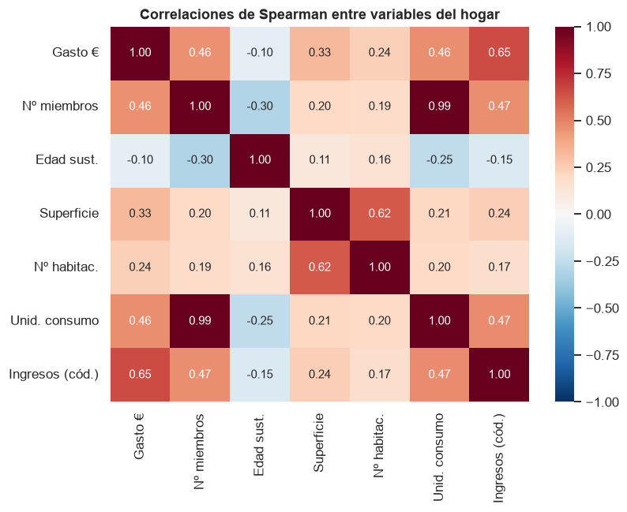

La distribución del gasto por tramo de renta, representada en escala logarítmica, ilustra tanto el crecimiento del gasto con la renta como la reducción de su dispersión relativa.

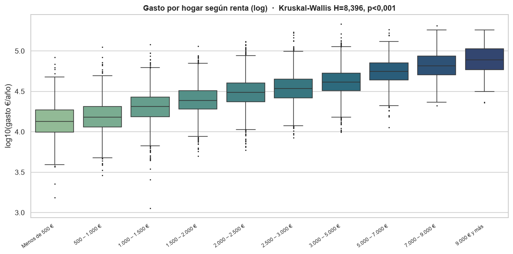

## 9. Panel interactivo (dashboard)

Los hallazgos anteriores se han sintetizado en un panel operativo en Power BI que permite a cualquier usuario explorar los datos de forma interactiva. El panel incluye cuatro indicadores clave (gasto medio por hogar, hogares representados, peso de la vivienda e inflación sentida media), filtros por comunidad autónoma, nivel de renta, tamaño del hogar y régimen de tenencia, y cuatro visualizaciones principales: el mapa de gasto por comunidad, la estructura del presupuesto, las curvas de Engel y la inflación sentida por nivel de renta. Al filtrar por cualquier segmento, todos los indicadores se recalculan, lo que permite comprobar en directo cómo cambia la exposición a la inflación según el tipo de hogar.

## 10. Conclusiones

1. El hogar español medio gastó 34.044 euros en 2024, concentrando casi un tercio de su presupuesto en la vivienda y sus suministros.
2. La composición del gasto cambia de forma sistemática con la renta (Ley de Engel): a menor renta, mayor peso de la alimentación y la vivienda; a mayor renta, más peso del ocio y la restauración.
3. Existen diferencias territoriales relevantes, con Madrid a la cabeza y Extremadura en la cola del gasto por hogar.
4. La conclusión principal es que **la inflación de 2024 no afectó por igual a todos los hogares: los de menor renta soportaron una inflación sentida sensiblemente mayor**, al gastar más en las categorías que más se encarecieron. Este resultado, que solo emerge al cruzar consumo y precios, tiene implicaciones directas para el diseño de políticas de apoyo a la renta.
5. Todas las diferencias analizadas resultan estadísticamente significativas.

## 11. Limitaciones y líneas futuras

El análisis se basa en datos de corte transversal de un único año (2024), por lo que no captura la evolución temporal. La inflación sentida se ha construido a nivel de grupo de gasto (13 categorías), de modo que asume que dentro de cada grupo todos los hogares afrontan la misma variación de precios. Como líneas futuras, sería posible ampliar el estudio a varios años para analizar la evolución de la exposición a la inflación, o descender a un mayor detalle de categorías COICOP.

## 12. Fuentes

- Instituto Nacional de Estadística (INE). Encuesta de Presupuestos Familiares, 2024. Microdatos.
- Instituto Nacional de Estadística (INE). Índice de Precios de Consumo, 2024. Índices por comunidades autónomas y grupos ECOICOP.
